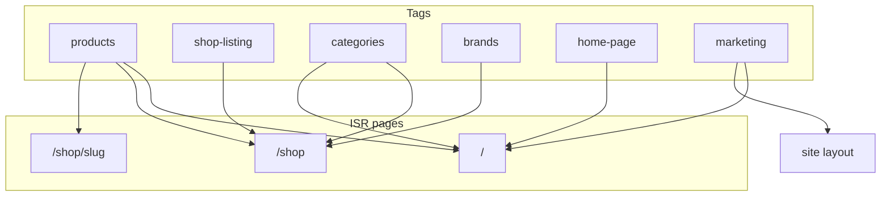

# Cache tags and invalidation

Storefront data uses Next.js `unstable_cache` with shared **tags**. Admin writes call functions in `src/lib/cache/revalidate.ts`, which run `revalidateTag` (data cache) and `revalidatePath` (ISR HTML).

## Tag registry (`tags.ts`)

| Tag | Constant | Cached data |
|-----|----------|-------------|
| `products` | `PRODUCT_CATALOG_TAG` | New arrivals, best sellers, PDP, shop facets (diecast/discounts) |
| `shop-listing` | `SHOP_LISTING_TAG` | `getShopListing`, facet bundles, category tree |
| `categories` | `CATEGORIES_TAG` | Category tree, nav categories, home fallback categories |
| `brands` | `BRANDS_TAG` | Header nav brands |
| `header-nav` | `HEADER_NAV_TAG` | `getHeaderNavData` |
| `home-page` | `HOME_PAGE_TAG` | `getHomePageData` bundle |
| `marketing` | `MARKETING_TAG` | Site settings, chrome colors, hero overlay fields |
| `announcements` | `ANNOUNCEMENTS_TAG` | Utility/marquee bars |
| `marketing-popups` | `POPUPS_TAG` | Admin popup list cache |
| `flash-sales` | `FLASH_SALES_TAG` | Flash sale list + PDP pricing |
| `orders` | `ORDERS_TAG` | Best-seller ranking |
| `product:slug:{slug}` | `productSlugTag()` | Single PDP (`getProductBySlug`) |
| `product:reviews:{id}` | `productReviewsTag()` | Approved reviews on PDP |

## ISR pages (`revalidatePath`)

| Path | `revalidate` | Invalidated by |
|------|--------------|----------------|
| `/` | 60s | `revalidateHomePage`, `revalidateProductCatalog`, `revalidateCategoryCatalog`, `revalidateBrandCatalog`, `revalidateFlashSales`, `revalidateMarketingSite` |
| `/shop` | 30s | `revalidateShopListing`, `revalidateProductCatalog`, taxonomy/brand/category helpers |
| `/shop/[slug]` | 300s | `revalidateProductCatalog` (with slug), `revalidateProductById`, `revalidateFlashSales` |
| Site layout | 120s | `revalidateMarketingSite`, `revalidateCategoryCatalog`, `revalidateAnnouncements` (`layout`) |

## Revalidation helpers

| Function | Tags | Paths | Use after |
|----------|------|-------|-----------|
| `revalidateProductCatalog` | products, shop-listing, home-page, optional slug | `/`, `/shop`, `/shop/[slug]` | Product CRUD, CSV import, images, variants |
| `revalidateProductById` | above + reviews | above | Flash sale, images, variants when only id known |
| `revalidateCategoryCatalog` | categories, shop-listing, products, header-nav, home-page | `/`, `/shop`, layout | Category admin CRUD |
| `revalidateBrandCatalog` | brands, header-nav, shop-listing, home-page | `/`, `/shop` | Brand admin CRUD |
| `revalidateShopTaxonomy` | shop-listing | `/shop` | Subtypes, collections, product types |
| `revalidateMarketingSite` | marketing, announcements, header-nav, home-page, popups | `/`, layout | Marketing settings |
| `revalidateAnnouncements` | announcements | layout | Announcement CRUD |
| `revalidatePopups` | marketing-popups, marketing | — | Popup CRUD (client also uses `/api/public/marketing`) |
| `revalidateFlashSales` | flash-sales, products, shop-listing, home-page | `/`, `/shop`, optional PDP | Flash sale admin |
| `revalidateHomePageContent` | home-page | `/` | Hero, highlights, brand rail, category tiles |
| `revalidateInventoryCatalog` | full product stack | storefront paths | Inventory admin, CSV inventory |

## Admin route map

### Products
- `POST/PATCH/DELETE /api/admin/products` → `revalidateProductCatalog`
- `POST /api/admin/products/[id]/images` → `revalidateProductById`
- `POST/PATCH/DELETE /api/admin/products/[id]/variants` → `revalidateProductById`
- `POST /api/admin/csv/products` → `revalidateProductCatalog`

### Categories
- `POST/PUT/DELETE /api/admin/categories` → `revalidateCategoryCatalog`

### Brands
- `POST/PUT/DELETE /api/admin/brands` → `revalidateBrandCatalog`

### Shop taxonomy
- `POST/PUT/DELETE /api/admin/product-subtypes` → `revalidateShopTaxonomy`
- `POST/PUT/DELETE /api/admin/product-collections` → `revalidateShopTaxonomy`
- `POST/PUT/DELETE /api/admin/product-types` → `revalidateShopTaxonomy`

### Marketing — site
- `PATCH /api/admin/marketing/settings` → `revalidateMarketingSite`

### Marketing — homepage CMS
- Hero / highlights / brand rail / category tiles CRUD → `revalidateHomePageContent`

### Marketing — other
- Announcements CRUD → `revalidateAnnouncements`
- Popups CRUD → `revalidatePopups`
- Flash sales CRUD → `revalidateFlashSales` + `revalidateProductById`

### Inventory
- `PATCH /api/admin/inventory/[id]` → `revalidateInventoryCatalog`
- `POST /api/admin/csv/inventory` → `revalidateInventoryCatalog`

### Reviews
- Approve / reject / delete → `revalidateProductReviewsByReviewId`

### Diecast scales
- CRUD → `revalidateProductCatalog` (shop diecast facets)

## Dependency graph

## Notes

- **`/api/public/marketing`** uses HTTP `Cache-Control` (60s private), not `unstable_cache`. Popup changes call `revalidatePopups`; clients may need navigation or cache bust to see updates immediately.
- **Orders**: best-seller cache uses `ORDERS_TAG`; order webhooks are not wired yet—ranking refreshes on TTL or product revalidation.
- **Sitemap**: `revalidateSitemap()` available; call from product bulk import if needed.
